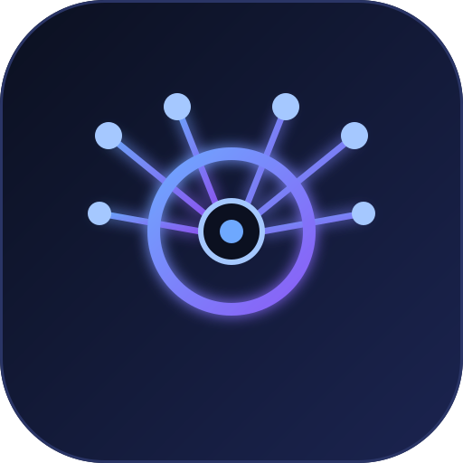

<div align="center">



# hark-pool

**Hark アカウントを一括作成し、プール全体を 9Router 用の単一の OpenAI 互換プロバイダーとして公開します。**

ヘッドレス登録 · セッション Cookie 取得 · ラウンドロビン · 依存ゼロ

[](https://nodejs.org)
[](../LICENSE)
[](../package.json)
[](https://platform.openai.com/docs/api-reference/chat)
[](https://9router.com)

[English](../README.md) · [Indonesia](README.id.md) · [Español](README.es.md) · [日本語](README.ja.md) · [中文](README.zh.md)

</div>

---

## これは何か

`hark-pool` は、監査しやすい小さなツールキットです:

1. **Hark アカウントをブラウザなし（ヘッドレス）で作成** — [mail.tm](https://mail.tm) の受信箱を
   作り、Hark のマジックリンクを要求・検証し、パスワードを設定して年齢ゲートを通過します。
2. **各セッションを取得** — Hark は Better-Auth の **Cookie**（Bearer トークンなし）を使うため、
   アカウントごとに `__Secure-hark.session_token` とセッション ID を保存します。
3. **1 つの OpenAI エンドポイントにプール** — `adapter.js` が Cookie とポーリングによる Hark の
   チャットを標準の `POST /v1/chat/completions` に変換します。
4. **プールを 9Router に接続** — 9Router を指す任意の CLI/IDE が使える OpenAI 互換の
   provider-node（"Hark"）を 1 つ作成します。

```
OpenAI クライアント ──▶ 9Router :20128/v1 ──▶ provider-node "Hark"
                    ──▶ adapter  :8790/v1  ──▶ N 個の Hark アカウントをラウンドロビン
                    ──▶ hark.com /api/messages/{send,history}   (Cookie 認証)
```

> 全体の構成・ファイルマップ・データフロー図は **[STRUCTURE.md](../STRUCTURE.md)** を参照してください。

---

## なぜアダプターが必要か

Hark のチャット API は OpenAI の形をしていません:

| 段階 | Hark | OpenAI |
|------|------|--------|
| 送信 | `POST /api/messages/send?cid=…` → 即座に `{success:true}` | 1 回の呼び出しで応答を返す |
| 受信 | `GET /api/messages/history?conversationId=…` をポーリング | インライン（または SSE）で返す |
| 認証 | httpOnly Cookie | `Authorization: Bearer` |

`adapter.js` がこの違いを隠すので、9Router とその先のすべてのツールは通常の OpenAI
プロバイダーしか見ません。アカウントはラウンドロビンで使われ、死んだセッションはクールダウン
され、別のアカウントで再試行されます。

---

## 要件

- **Node.js 18+**（組み込みの `fetch` を使用）。`npm install` 不要、依存ゼロ、ビルド不要。
- `hark.com`、`auth.hark.com`、`api.mail.tm`、およびローカルの 9Router へのネットワークアクセス。
- コネクターの手順にのみ、稼働中の **[9Router](https://9router.com)** が必要です。

---

## クイックスタート

```bash
# 0) (任意) 既存プールの検証
node selftest.js

# 1) アカウント作成 -> accounts.json
node bulk.js --count 5 --concurrency 2

# 2) OpenAI 互換プールを起動
PORT=8790 ACCOUNTS=accounts.json node adapter.js

# 3) 9Router をインストールして起動  (ダッシュボード: http://localhost:20128)
npm install -g 9router && 9router
#    リモート/初回: 起動前に INITIAL_PASSWORD を設定 (既定パスワード: 123456)

# 4) Hark を 9Router に接続
node connect-9router.js --base http://localhost:20128 --password 123456 \
     --adapter http://localhost:8790
```

任意の OpenAI クライアントを 9Router に向けます:

```
Base URL : http://localhost:20128/v1
API Key  : <9Router ダッシュボードからコピー>
Model    : hark/account-1        # 任意の hark/* モデル。アダプターがラウンドロビン
```

---

## CLI リファレンス

### `bulk.js`

| フラグ | 既定 | 意味 |
|--------|------|------|
| `--count N` | `1` | 作成するアカウント数 |
| `--concurrency N` | `2` | 並列ワーカー数 |
| `--out file` | `accounts.json` | 出力ファイル（追記） |
| `--domain d` | 最初の有効な mail.tm ドメイン | mail.tm ドメイン |
| `--birthday YYYY-MM-DD` | `1995-06-15` | 生年月日（18 歳以上） |
| `--password "…"` | ランダム | Hark の固定パスワード（未指定ならアカウントごとにランダム） |
| `--connect <url>` | — | 作成後に 9Router コネクターを実行 |

各実行は `accounts.json` に**追記**します。失敗は 3 回再試行します。

### `adapter.js`（環境変数）

| 変数 | 既定 | 意味 |
|------|------|------|
| `PORT` | `8790` | 待ち受けポート |
| `ACCOUNTS` | `accounts.json` | プールファイル |
| `COOLDOWN_MS` | `60000` | 失敗したアカウントを退避させる時間 |

### `connect-9router.js`

| フラグ | 既定 | 意味 |
|--------|------|------|
| `--base` | `http://localhost:20128` | 9Router の URL |
| `--password` | `123456` | 9Router ダッシュボードのパスワード |
| `--adapter` | `http://localhost:8790` | アダプターのベース URL |
| `--accounts` | `accounts.json` | プールファイル（接続ラベル用） |

---

## `accounts.json` の形式

```json
{
  "email": "hark…@maxxspace.com",
  "password": "Hark-…",
  "userId": "f1Yz…",
  "sessionToken": "Tlsy…",
  "sessionId": "QFpj…",
  "expiresAt": "2026-11-06T11:13:11.077Z",
  "cookies": {
    "__Secure-hark.session_token": "…",
    "__Secure-hark.region": "us",
    "__Secure-hark.access": "app"
  },
  "cookieHeader": "__Secure-hark.session_token=…; __Secure-hark.region=us; __Secure-hark.access=app",
  "mailbox": { "address": "…", "password": "…", "token": "…" },
  "birthday": "1995-06-15",
  "region": "us",
  "createdAt": "2026-10-07T11:13:11.976Z"
}
```

> `accounts.json` は有効な資格情報を含み、**git 管理外**です。コミットされるのは
> `accounts.sample.json`（伏せ字）のみです。

---

## 登録の仕組み（リバースエンジニアリング）

| # | 呼び出し | 備考 |
|---|----------|------|
| 1 | `POST https://api.mail.tm/accounts` | 受信箱を作成、アドレス + JWT を取得 |
| 2 | `POST https://auth.hark.com/api/auth/sign-in/magic-link` `{email, callbackURL}` | → `{"status":true}` |
| 3 | `GET https://api.mail.tm/messages` をポーリング | "Your Hark sign-in link" を読む |
| 4 | `GET …/magic-link/verify?token=…` | セッション Cookie を設定 |
| 5 | `POST …/set-password {newPassword}` | **`Origin: https://hark.com` が必要** |
| 6 | `PATCH https://hark.com/api/profile {updates:{birthday}}` | `hasAppAccess` を `true` にする |
| 7 | `GET …/get-session` | `emailVerified:true` を確認し `session.token` を返す |

**チャット:** `POST /api/messages/send?cid=…` の後、`GET /api/messages/history?conversationId=…`
をポーリングしてアシスタントの `send_bubble` メッセージを取得します。

---

## 注意と制限

- Hark は **Claude Opus / Sonnet / Haiku** を提供し、モデルはサーバー側で選ばれます。チャットに
  モデル選択はないため、アダプターはプロンプトをそのまま転送します。
- **mail.tm のレート制限:** IP あたり約 60 秒に 1 アカウント作成、読み取りも制限されます。
  bulk creator は作成間で 65 秒待ち、控えめにポーリングします。
- Hark の**非公開 Web API** を利用しています。予告なく変更される可能性があります。
- 多数のアカウントをプールすると Hark の使用量メーターを消費し、不正利用対策を誘発する場合が
  あります。

---

## コントリビュート

Issue とプルリクエストを歓迎します。依存ゼロのルールを守ってください: Node 18 にないものは
追加しないでください。

## 免責事項

本プロジェクトは Hark や 9Router とは無関係です。第三者の利用規約および適用法を守る責任は
利用者にあります。教育および相互運用を目的として提供されています。

## ライセンス

[MIT](../LICENSE) © 2026 0xgetz
